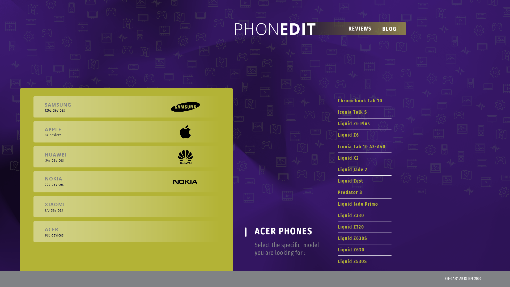

# This is the readme file for the final project from SEI-ES 01 course.

## DESCRIPTION
This is our fourth and last project that consists of creating an application called PhonEdit.
Our main idea is to show an interactive application where the user can consult the different brands of mobile phones where they can see the general characteristics of the chosen mobile.
In addition, it is possible to add a series of free comments in the blog of the page.

## TEAM MEMBERS
Ariel, Jeferson and Ismael from SEI-ES 01.
# Technologies used

## HOW TO RUN
- Clone repository
- Click URL link.
## CHALLENGES
The main challenge we had to grapple with in this full stack project was creating MVC (model, view, controller) and CRUD at the same time using a scraper.
From the client side, we had a lot of minor hiccups, like searching for data.
from the back-end and display on the screen to continue advancing in the application.
## WIREFRAMES

